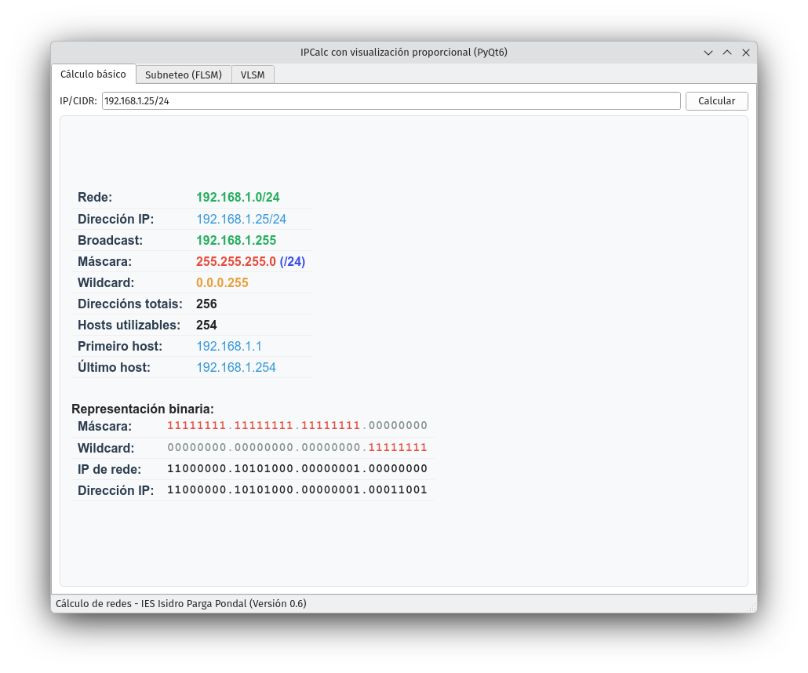
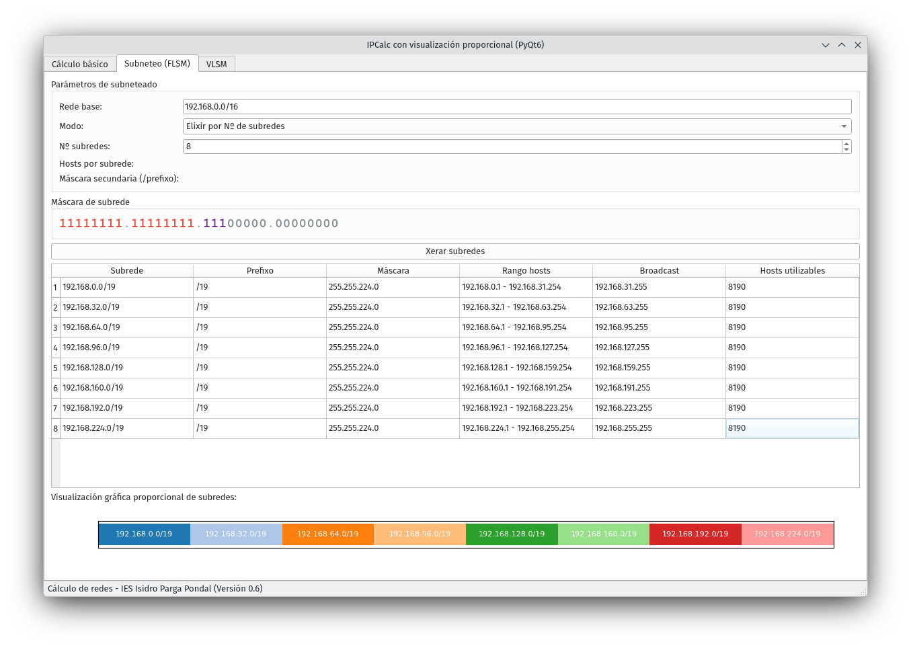
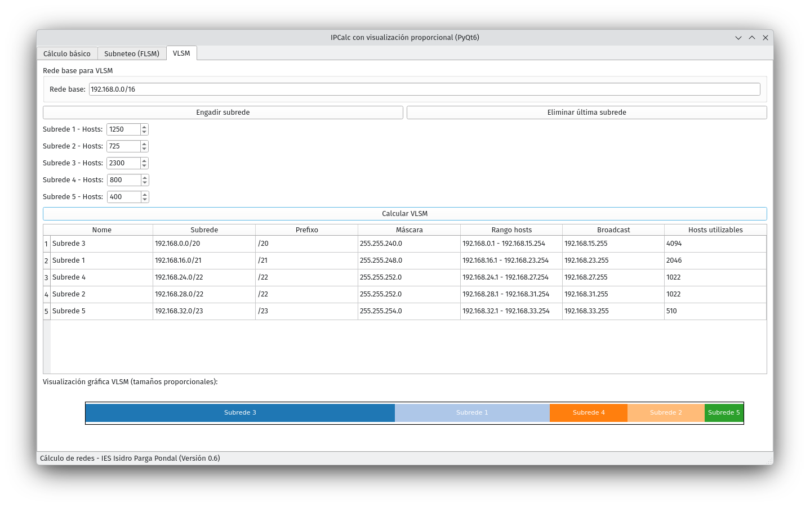

# Calculadora de subredes con PyQt6

Calculadora de sudredes FLSM e VLSM.

- Cálculo básico IP/CIDR (red, broadcast, netmask, wildcard, rango de hosts, número de hosts)
- Subneteo avanzado (por número de subredes, por hosts ou por máscara secundaria)
- Táboa de subredes xeradas
- Visualización gráfica proporcional (o tamaño de cada subrede reflexa a súa cantidade de direccións)

---
## Requisitos:
Paquetes PyQt6 e matplotlib de Python3

```shell
    pip install PyQt6 matplotlib
```

## Execución:
```shell
    python qt6-ipcalc.py
```
---

## Cálculo básico


## Subnetting FLSM


## Subnetting VLSM

